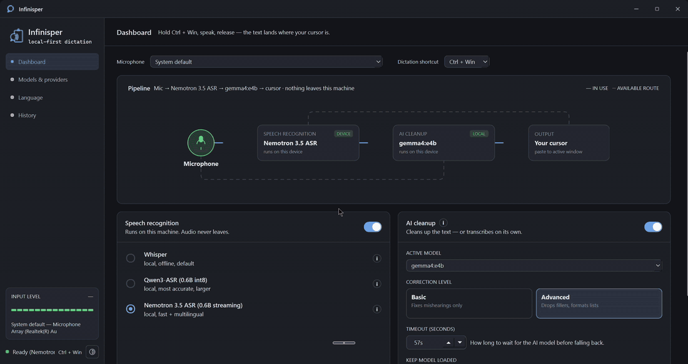

<p align="center">
  
</p>

<h1 align="center">Infinisper</h1>
<p align="center"><strong>Free, open-source & local-first Wispr Flow alternative for Windows.</strong></p>
<p align="center"><em>Hold a key, speak anywhere, release — clean, polished text appears at your cursor in ~0.5s.</em></p>

<p align="center">
  <a href="https://github.com/amangit007/infinisper/actions/workflows/tests.yml"></a>
  
  
  
  
  
</p>

<p align="center">
  
</p>

Wispr Flow made hold-to-talk voice dictation feel effortless, but a paid monthly subscription and streaming your live microphone audio to third-party cloud servers isn't for everyone.

**Infinisper gives you that same seamless dictation experience on Windows — completely free, open source, and running on your own PC.**

- **Runs on your CPU**: Core speech recognition streams in real time on standard consumer CPUs without requiring a dedicated GPU.
- **Optional local AI polish**: Pair it with [Ollama](https://ollama.com) to strip filler words ("um", "uh"), fix grammar, and format bulleted lists entirely offline.
- **Private by default**: Audio is processed in RAM and discarded immediately. No recordings saved to disk, no cloud accounts, and zero telemetry.

---

## How it compares

| Feature | Infinisper | Cloud Dictation (e.g. Wispr Flow) | Typical Whisper Wrappers |
|---|---|---|---|
| **Pricing** | **Free & Open Source (MIT)** | Paid subscription (~$5+/month) | Free / Open Source |
| **Speech Recognition** | **100% Local (Runs on CPU)** | Cloud servers | Local or Cloud |
| **Latency** | **~0.24s (Streaming ASR)** | ~1.0s | 2–8s (Batch waits for take to finish) |
| **Hardware Needed** | **Standard Intel / AMD CPU** | Any (Cloud-based) | Often needs high-end NVIDIA GPU |
| **AI Formatting & Cleanup** | **Local via Ollama** (or Cloud) | Cloud AI | None (raw transcription only) |
| **Audio Privacy** | **100% Local (RAM only)** | Sent to remote servers | 100% Local |
| **Clipboard Safety** | **Preserves & restores previous clipboard** | Direct hook / paste | Often overwrites clipboard |

---

## Why it feels instant (even on CPU)

Most offline speech tools use batch processing: you speak for 20 seconds, release the key, and then wait several seconds while the model decodes the full audio.

Infinisper uses **real-time streaming speech recognition**. It processes 50 ms audio chunks *while you are still speaking*. By the time your finger leaves the hotkey, 95% of the transcription is already completed.

### Measured response times (key release → text pasted)

Measured on a standard laptop CPU (Ryzen 7, 8 cores). The speech engine runs **purely on the CPU**:

| Stage | What runs | Hardware | Wait time |
|---|---|---|---|
| **Speech to Text** | Nemotron (Streaming ASR) | **CPU** | **~0.24 s** *(constant, however long you spoke)* |
| **Optional AI Cleanup** | Ollama (e.g. Qwen 0.5B–1.5B) | Local CPU / GPU | **+ 0.30–0.50 s** *(nothing leaves PC)* |
| **Optional Cloud Cleanup** | Groq or Gemini 3.5 Flash Lite | Free Cloud API | + 0.50–0.80 s |

> **Total time from releasing the hotkey to formatted text:**
> - **~0.24 s** with local speech recognition alone (raw verbatim text)
> - **~0.56 s** with local speech + recommended local Ollama cleanup
>
> Every benchmark is reproducible on your own PC via the scripts in [`benchmarks/`](benchmarks). See the full [Benchmarks Guide](docs/benchmarks.md) for memory consumption, accuracy scores, and multilingual evaluations.

---

## What makes it great

- **Works in any application:** Press your global hotkey (`Ctrl+Win` by default, configurable to `Right Ctrl`, `F8`, etc.) in VS Code, Chrome, Slack, Notion, Word, or Windows Terminal.
- **Non-destructive clipboard:** Pastes via Windows clipboard but immediately restores whatever snippet, password, or code you had copied beforehand.
- **Pre-roll ring buffer:** Constantly keeps a rolling half-second audio buffer in memory, so you can speak the exact millisecond you press the hotkey without your first word getting cut off.
- **Studio-grade audio pipeline:** Automatically removes DC offset, applies a 23×-vectorized 80 Hz rumble filter, notches out mechanical key clicks, and trims silence with Silero VAD before decoding.
- **Three local speech engines to choose from:**
  - **Nemotron 3.5 ASR**: Ultra-fast real-time streaming, near-instant latency (~0.2s), and solid accuracy for English and fast Hindi dictation.
  - **Qwen3-ASR**: Overall accuracy champion across multilingual dictation (French, German, Chinese, Japanese, and complex/code-mixed Hindi).
  - **Whisper (base / small)**: Lightweight starter engine that works immediately with minimal memory.
- **Accuracy regulation in the Language tab:**
  - Set your dictation language explicitly for instant model guidance.
  - Add names, project acronyms, and technical jargon to the built-in dictionary so they are never misheard.
- **Flexible processing modes:** Speech-only (pure local speed), Speech + Cleanup (local ASR + Ollama/cloud polish), or Direct Audio-to-AI (routes audio straight to multimodal models like Gemini for **zero local model RAM usage** on low-spec PCs).
- **Lightweight floating pill:** Clean minimalist overlay showing live mic levels and dictation status that never steals window focus. Supports light and dark mode.

---

## Quick start (under 2 minutes)

### Requirements
- **Windows 10 or 11** (64-bit)
- **Python 3.12, 3.13, or 3.14** (ensure **"Add Python to PATH"** is checked during installation)
- Standard multi-core CPU (no dedicated GPU required)

### Setup

```cmd
git clone https://github.com/amangit007/infinisper.git
cd infinisper
install.bat
run.bat
```

1. `install.bat` creates a virtual environment and installs dependencies.
2. `run.bat` launches Infinisper into your system tray and opens the Dashboard.
3. Put your cursor in any app, hold **`Ctrl + Win`**, speak, and release.

Infinisper starts with Whisper out of the box (downloads a lightweight ~140 MB model on first launch). To enable real-time streaming, head to **Models & providers** in the app and click to download **Nemotron 3.5**.

### Recommended: Local AI cleanup with Ollama

For the full Wispr Flow experience (stripping "um/uh", fixing grammar, formatting lists into bullets) without anything leaving your machine:
1. Install [Ollama](https://ollama.com) and pull a small model:
   ```cmd
   ollama run qwen2.5:0.5b
   ```
2. Open Infinisper's **Models & providers** tab, select **Ollama (local)**, and choose your model.
3. That's it — 100% offline, intelligent dictation.

---

## Documentation

Comprehensive guides covering setup, tuning, and internal architecture:

| Guide | Description |
|---|---|
| [Getting Started](docs/getting-started.md) | Installation, first dictation, tray options, and hotkey configuration |
| [Choosing a Model](docs/choosing-a-model.md) | Comparing speech engines (Nemotron, Qwen3, Whisper) and cleanup models |
| [Performance Guide](docs/performance-guide.md) | CPU optimization, latency tuning, and recommended setups |
| [Benchmarks](docs/benchmarks.md) | Verified latency, memory usage, and multilingual accuracy benchmarks |
| [How It Works](docs/how-it-works.md) | Audio engineering, ring buffers, streaming architecture, and paste mechanics |
| [Privacy](docs/privacy.md) | Exact details on memory handling, data isolation, and API security |
| [Troubleshooting](docs/troubleshooting.md) | Solutions for hotkeys, audio devices, and local connections |

---

## Built with

| Component | Library / Framework | License |
|---|---|---|
| **UI** | PySide6 (Qt for Python) | LGPL-3.0 |
| **Speech Engines** | sherpa-onnx (Nemotron, Qwen3), faster-whisper | Apache-2.0 / MIT |
| **Audio Processing** | Silero VAD, SoundDevice, NumPy | MIT / BSD |
| **AI Cleanup** | LiteLLM (Ollama, Gemini, Groq, OpenAI) | MIT |
| **Key Storage** | Keyring (Windows Credential Manager) | MIT |

---

## Development & Testing

```cmd
.\.venv\Scripts\pip install -r requirements-dev.txt
.\.venv\Scripts\pytest
python benchmarks/engines.py
```

The test suite covers the audio processing pipeline, streaming chunking logic, clipboard restoration safety, and cleanup fallbacks.

---

## License

Released under the [MIT License](LICENSE).
